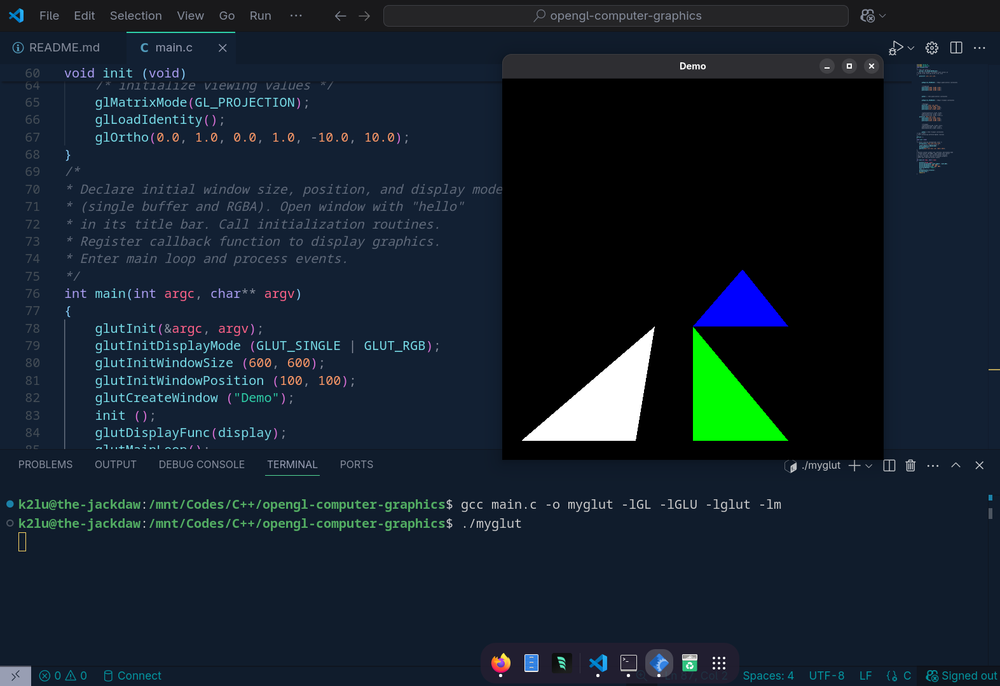

# opengl-computer-graphics
To install freeglut on fedora:
``` bash
sudo dnf install freeglut
```

To compile:   
``` bash
gcc <program-name>.c -o <executable-name> -lGL -lGLU -lglut -lm
```
Or (C++, recommended)
``` bash
g++ <program-name>.cpp -o <executable-name> -lGL -lGLU -lglut -lm
```

To run executable file:
``` bash
./<executable file name>
```

Example:
</img>

